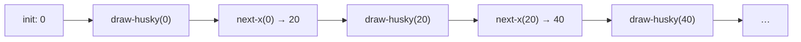

## Skills: [0](</skills/#(0)>), [1](</skills/#(1)>)

## Purpose

See how animations and interactive programs are built from ordinary functions, using Pyret reactors.

## Introduction

The amount of programming we've learned so far is already enough to build some interesting programs. This lab will:

- give you more practice writing functions and conditionals
- show you how animations can be created from functions
- introduce *reactors*, which you will use again on [Project 2](/homework/6)

You might not get through every optional feature. That's okay — the important part is understanding how a handful of functions become an animation.

We're going to animate a husky heading home to its doghouse.


Take a minute to look at this gif with your partner:

1. What elements do you see on the screen?
2. What is moving? What is not moving?

Write your answers as comments in your Pyret file.

Copy this into your Pyret file (put the `include` lines at the very top):

```pyret
include image
include reactors

HUSKY-URL =
  "https://raw.githubusercontent.com/neu-pdi/cs2000-public-resources/refs/heads/main/static/img/lab5-husky.png"
DOGHOUSE-URL =
  "https://raw.githubusercontent.com/neu-pdi/cs2000-public-resources/refs/heads/main/static/img/lab5-doghouse.png"
BACKGROUND-URL =
  "https://raw.githubusercontent.com/neu-pdi/cs2000-public-resources/refs/heads/main/static/img/lab5-background.png"

husky = scale(0.6, image-url(HUSKY-URL))
doghouse = scale(0.6, image-url(DOGHOUSE-URL))
background = image-url(BACKGROUND-URL)

BACK = 40
HEIGHT = 400
WIDTH = 750
DOGHOUSE-X = WIDTH - 120
GROUND-Y = HEIGHT - 90
```

If you prefer different images, you may replace the URLs, but don't spend more than a few minutes looking.

Pyret has a useful function [`image-url`](https://www.pyret.org/docs/latest/image.html#%28part._image_image-url%29) for loading pictures from the web. Once they're loaded, you can manipulate them like any other `Image`.

**Note:** You will find [`place-image`](https://www.pyret.org/docs/latest/image.html#%28part._image_place-image%29) more useful than `overlay-xy`. It lets you fix one image (the background) and put another (the doghouse, then the husky) on top of it at a coordinate. You can nest calls to `place-image`, just as you have with other image functions.

**Note:** The origin of the background (the point `(0, 0)`) is the *top left* corner. Increasing `x` moves right; increasing `y` moves *down*. `place-image` positions an image by its *center*.

**Hint:** If the husky or doghouse looks too large or too small, adjust the `scale` in the starter code.

___

## Problem 1

An animation is a sequence of images (usually called *frames*) that some tool flips through quickly, creating the *illusion* of motion. Here is an example sequence of frames for our husky:

| Frame 1 | Frame 2 | Frame 3 |
| :---: | :---: | :---: |
|  |  |  |

We'll start by drawing one frame.

### Part A

Write an expression that generates the frame where the husky is at x-coordinate `100` and the same ground y-coordinate as the doghouse. If your code is correct, you should see something close to the first frame above. Remember to include the doghouse!

### Part B

Discuss with your partner: where specifically would the expression you wrote for one frame be edited to place the husky at a different x-coordinate?

### Part C

Create a function called `draw-husky` that takes one `Number` input (the husky's `x` coordinate) and produces the frame `Image` with the husky at that x-coordinate. You do not need a `where` block for this function (we'll come back to that later). Remember to include the doghouse!

## Problem 2

With `draw-husky`, we can generate a whole sequence of images:

```pyret
draw-husky(0)
draw-husky(20)
draw-husky(40)
draw-husky(60)
draw-husky(80)
# ...
```

That creates all the frame images, but we are still writing (roughly) the same expression over and over. If we want to generate frames automatically, it would be great to have a program *generate the sequence*, not just the individual images.

### Part A

Look at each pair of consecutive `draw-husky` calls. Is there a *pattern across the differences*? What do you notice? Discuss with your partner.

<details>
<summary><strong>Finish your discussion before opening!</strong></summary>

The `x` coordinate is increasing by 20 from one expression to the next. A constant difference in coordinate is how we get a consistent rate of motion. We're manually doing the same computation (increase by 20) over and over — and that also sounds like a function!

</details>

### Part B

Add the following code to your file (no `where` block for now):

```pyret
fun next-x(x :: Number) -> Number:
  doc: "generate x coordinate for the next frame"
  x + 20
end
```

If we have an initial x-coordinate, we can draw the first frame, use `next-x` to get the next coordinate, draw the second frame, and repeat. In other words, these two functions already *define* an animation. If we could get Pyret to use them to generate the images and flip through them, we'd be done.

### Part C

Write down any questions you have at this point as comments. Discuss them with your partner or a TA.

## Problem 3

Luckily, Pyret has something called a `Reactor` that does this for us. Add the following at the *bottom* of your file, then run it:

```pyret
husky-reactor = reactor:
  init: 0,
  to-draw: draw-husky,
  on-tick: next-x
end

interact(husky-reactor)
```

You should see something like the animation we described: the husky runs to the right, past the doghouse, and off the screen. You'll have a chance to fix that later.

A reactor is a special value in Pyret (like a `String`, `Number`, `Image`, or `Boolean`) with components that together create the animation you see when you call `interact`:

- `init: 0` — the **init**ial x-coordinate; the first value of whatever will change from frame to frame
- `to-draw: draw-husky` — the function that returns an image based on the current x-coordinate
- `on-tick: next-x` — the function that takes the x-coordinate for a frame and returns the coordinate for the next frame. Its first input is the `init` value.

Behind the scenes, `interact` runs a loop: draw, update, draw, update, …



The punchline: you could replace `draw-husky` and `next-x` with *any* functions and get an animation where a single piece of information changes between frames (change the background, the images, have the husky run the other way). Later in the course, we'll make animations where *multiple* pieces of information change. For now, all you need is that **functions are the basis of movement in animations** — so you can already do a lot with what you've learned.

### Part A

Figure out how to make the husky run slower or faster. What would you change? Try it out!

### Part B

Look at the reactor diagram and the code. Note any observations or questions about reactors as comments.

## Problem 4

What's the difference between an animation and an interactive program? In a game or interactive scene, how elements move is influenced by what a person does (like pressing keys).

So far, our reactor uses `next-x` to move the husky every few milliseconds. What if we wanted a human to press a key to send the husky *back* a bit — a startled hop away from the doghouse?

Specifically: if the user presses `"b"`, reduce the husky's x-coordinate by `40` pixels (use the `BACK` constant). Finish designing `back-husky`: write `where` examples and the implementation. Since the output differs based on the input, you'll need a conditional.

```pyret
fun back-husky(x :: Number, key :: String) -> Number:
  doc: "if the key is 'b', move left by BACK; otherwise return x as given"
end
```

Then add `back-husky` to your reactor (just add the `on-key` line; the rest stays the same):

```pyret
husky-reactor = reactor:
  init: 0,
  to-draw: draw-husky,
  on-tick: next-x,
  on-key: back-husky
end
```

Run the code and try it: the husky should keep running right, and pressing `b` should scoot it left.

## Problem 5

So far this lab has told you not to worry about `where` blocks. Let's revisit that. We've written three functions:

- `draw-husky` (`Number` → `Image`)
- `next-x` (`Number` → `Number`)
- `back-husky` (`Number`, `String` → `Number`)

### Part A

Discuss with your partner: do some of these functions seem easier to write examples for? Which ones, and **why**? Write your answer as a comment.

<details>
<summary><strong>Our response — read after writing down your own answer</strong></summary>

Image-producing functions are harder to write examples for because you have to repeat (almost) the same image-building code in both the function body and the example answer. With functions that return numbers, you can just write the numeric answer.

</details>

In general, we don't write `where` examples for functions that produce `Image`s. You *should* write them for functions that return `Number`s, `String`s, and `Boolean`s, because you can write the answers without repeating the function body.

Writing examples for something as simple as `next-x` might seem pointless. The point shows up more clearly with `back-husky`: a crisp set of examples is easier for someone else to read than an entire `if` expression.

Remember, examples serve three purposes:

- help other human readers understand what your function does, in more detail than a doc string
- help make sure *you* understand the problem independently of the code
- help you check that your code produces the answer you expect

### Part B

Until now in the course, we have created functions mainly to:

- give a name to repeated expressions (so we can reuse them)
- add clarity by naming intermediate computations

Reactors use functions for a slightly different purpose: they *bundle up a computation so that another piece of code (that you didn't write) can use it when needed*. The reactor knows how to make animations (draw pictures, update a value, repeat), but only *you* know the details you want. The function is a communication mechanism: you give those details to another piece of code that performs a common task.

Discuss with your partner: why do we need functions to write an animation? What questions do you have about functions or reactors? Write them as comments.

## Problem 6

Here are some additional features you can implement if you have time. You can also come up with your own.

### Part A

Write a function `at-doghouse` that takes an x-coordinate and returns a `Boolean` indicating whether the husky has reached (or run into) the doghouse.

*Hint:* Think about how close the husky's x-coordinate needs to be to `DOGHOUSE-X`. You may need to try a few thresholds, because `place-image` uses the center of each image.

Add it to your reactor with `stop-when`:

```pyret
husky-reactor = reactor:
  init: 0,
  to-draw: draw-husky,
  on-tick: next-x,
  on-key: back-husky,
  stop-when: at-doghouse
end
```

### Part B

Modify `draw-husky` so that once the husky has reached the doghouse, the frame is a different image — for example the same scene plus a `text` message, or just the doghouse with no husky still standing outside.
